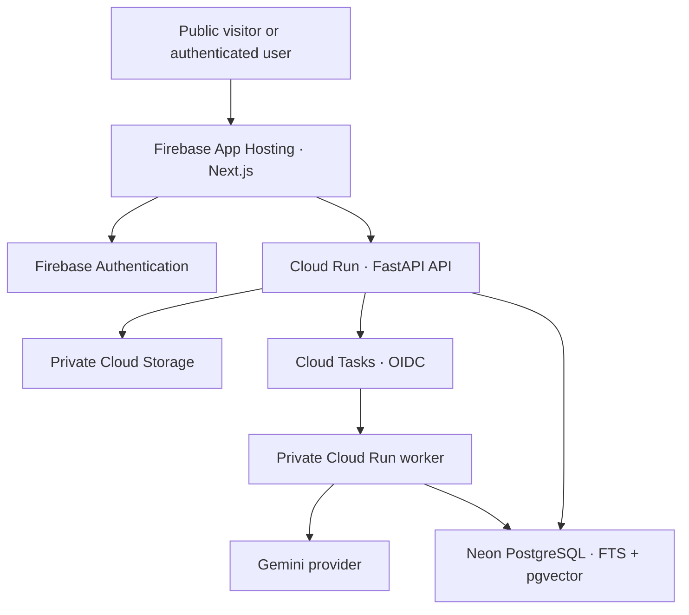

# GulfDocs

GulfDocs is a bilingual Arabic–English document-intelligence platform that extracts structured business data, validates financial and contractual fields, supports human review, and answers questions with page-level evidence.

This repository is under active phased development. The local product path is complete through the synthetic evaluation phase: it includes PostgreSQL/pgvector persistence, Firebase and deterministic development authentication, workspace authorization, direct uploads, idempotent processing, extraction/validation/review, hybrid retrieval, grounded Q&A, an authenticated product UI, and measured fictional-data evaluation. Cloud infrastructure and deployment are tracked in [`IMPLEMENTATION_STATUS.md`](./IMPLEMENTATION_STATUS.md).

> Public data is synthetic. Anonymous uploads are disabled. Do not use the project with confidential, personal, legally sensitive, or commercially sensitive material when it is configured with a free AI API tier.

## Live demo

Not deployed yet. Dedicated billing-enabled GCP project `gulfdocs` is selected; Firebase registration, deployed PostgreSQL, cloud resources, and rollout verification remain in the infrastructure phase.

## Why this is not a basic PDF chatbot

- Asynchronous, identifier-only processing is designed for at-least-once Cloud Tasks delivery.
- Typed extraction is followed by deterministic date, currency, arithmetic, confidence, and contract validation.
- Reviewers will correct fields, preserve revisions, and explicitly approve records.
- Retrieval combines PostgreSQL full-text search and pgvector under strict workspace/document filters.
- Answers must cite retrieved pages or return an explicit unsupported result.
- Provider, storage, authentication, queue, and repository boundaries keep local tests deterministic and cloud adapters replaceable.

## Architecture



Local development substitutes deterministic development auth, local filesystem storage, an inline task queue, a fake AI provider, and PostgreSQL with pgvector while preserving the same domain interfaces.

## Repository map

```text
apps/web                         Next.js App Router frontend
apps/api                         Public FastAPI API
apps/worker                      Private document-processing service
services/document_intelligence   Provider-neutral domain and local adapters
tests                            Cross-service smoke tests
docs                             Architecture decisions and guides
infrastructure                   Added in the infrastructure phase
evaluation                       Added with synthetic evaluation fixtures
data/synthetic                   Generated fictional PDF evaluation corpus
```

## Local setup

Prerequisites: Node.js 22+, pnpm 10+, uv, Docker, and Git. The workspace pins Python 3.12, which `uv` can install automatically.

```bash
cp .env.example .env
pnpm install --frozen-lockfile
uv sync --all-packages
docker compose up -d postgres
uv run alembic upgrade head
```

Start the services in separate terminals:

```bash
pnpm --filter @gulfdocs/web dev
uv run uvicorn gulfdocs_api.main:app --app-dir apps/api/src --reload --port 8000
uv run uvicorn gulfdocs_worker.main:app --app-dir apps/worker/src --reload --port 8001
```

The web app is served at `http://localhost:3000`; API health is at `http://localhost:8000/healthz`. The worker requires its local bearer token even in development.

## Quality commands

```bash
pnpm lint
pnpm typecheck
pnpm test
pnpm build
pnpm --filter @gulfdocs/web test:e2e
uv run ruff check .
uv run mypy apps/api/src apps/worker/src services/document_intelligence/src services/persistence/src evaluation
uv run pytest -m "not integration" --cov=gulfdocs_api --cov=gulfdocs_worker --cov=gulfdocs_document_intelligence
uv run pytest -m integration
make eval
```

Equivalent Make targets are provided for Linux, macOS, and WSL workflows. Tests and evaluation reports contain only executed results; no deployment, customer, uptime, or cost claims are fabricated.

## Measured deterministic evaluation

Dataset `2026-07-31.1` contains 12 fictional English, Arabic, and bilingual PDFs. The latest executed `fake-ai-v1` run measured 100% classification, 99.07% field extraction, 100% retrieval recall@3, 100% citation precision, and 100% unsupported-answer handling, with one disclosed difficult-date field failure. See [`docs/evaluation.md`](./docs/evaluation.md) and the full [JSON report](./evaluation/results/latest.json).

These are deterministic fake-provider regression measurements—not Gemini quality claims. Fake-path token usage is an approximation and its USD 0 API cost means no billable model call occurred.

## Firebase App Hosting

[`apps/web/apphosting.yaml`](./apps/web/apphosting.yaml) uses the currently documented `runConfig` schema with zero minimum instances, one maximum instance, one CPU, 512 MiB memory, and conservative concurrency. The intended frontend rollout owner is Firebase App Hosting’s GitHub integration; GitHub Actions will remain the quality gate to avoid competing frontend deploy pipelines.

## Current limitations

- The public demo uses seeded processed values and precomputed safe answers; it never spends Gemini quota.
- Live Cloud Storage, Cloud Tasks, Firebase Authentication/App Hosting, and Gemini/Vertex behavior are not yet cloud-verified.
- Deployed PostgreSQL is blocked on a Neon connection; local PostgreSQL/pgvector is fully tested.
- Free-tier optimization does not guarantee permanently zero cost. Budget alerts notify; they do not enforce a hard spending limit.

## License

[MIT](./LICENSE)
