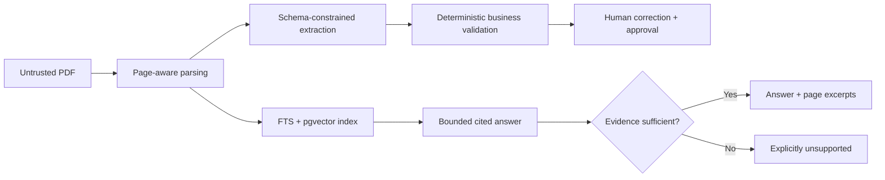
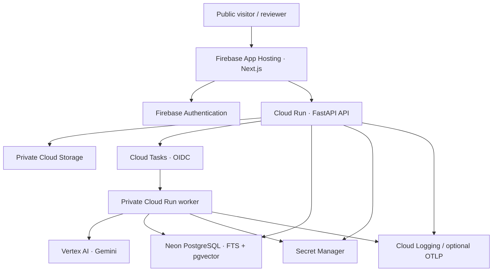
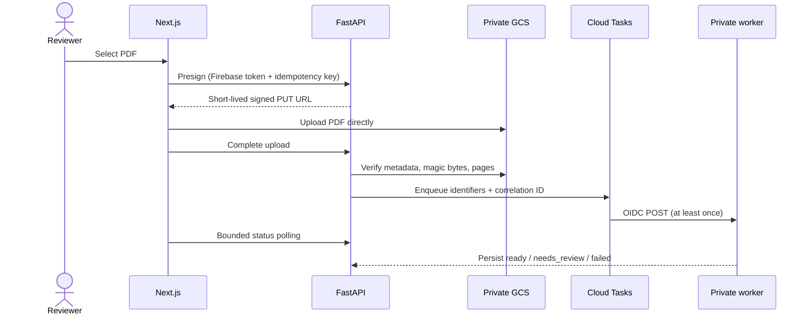

# GulfDocs

GulfDocs is a bilingual Arabic–English document-intelligence platform that extracts structured business data, validates financial and contractual fields, supports human review, and answers questions with page-level evidence.

It is designed as a production-oriented portfolio system—not a generic “chat with PDF” tutorial. The implementation includes asynchronous identifier-only jobs, schema-constrained extraction, deterministic validation, corrections and approval, hybrid PostgreSQL retrieval, citation enforcement, isolation tests, measurable evaluation, security controls, and conservative GCP infrastructure.

> Live demo: pending the production PostgreSQL secret and Firebase App Hosting repository connection. No URL is published until deployed smoke tests pass.

> Screenshots/video: intentionally pending a real deployed build; no mock screenshot or fake demo link is presented.

## Supported documents

- Invoices
- Quotations
- Purchase orders
- Short contracts (explicit text extraction only; no legal conclusions)

English, Arabic, and bilingual layouts are supported with RTL-aware UI. OCR and difficult-layout quality varies; see [known limitations](#known-limitations).

## Capabilities

- Direct signed PDF uploads with type, size, signature, page, quota, and workspace checks
- Deterministic LangGraph processing with idempotent at-least-once delivery
- Page-preserving PyMuPDF parsing and injection-signal detection
- Typed extraction with explicit unavailable values, confidence, and citations
- Arithmetic, date, currency, identifier, duplicate, confidence, and contract validation
- Human correction history, blocking approval rules, reviews, and privacy-safe audits
- PostgreSQL full-text + pgvector retrieval fused by reciprocal rank
- Grounded Q&A that cites retrieved pages or returns an explicit unsupported answer
- Authenticated usage/quality dashboard with failure/review rates and latency percentiles
- 12 fictional evaluation PDFs and reproducible fake/Gemini opt-in evaluation
- Firebase auth, private OIDC worker, private GCS, Secret Manager, IAM/WIF, CI/CD, retention

## Why it is not a basic PDF chatbot



The model cannot approve records, execute document instructions, access tools, or bypass workspace filters. Business rules and citation checks run outside the model.

## Architecture



Local mode swaps cloud boundaries for development auth, filesystem storage, inline Tasks, and a deterministic fake AI provider while keeping the same domain interfaces and PostgreSQL behavior.

## Upload sequence



## Processing sequence

The worker validates identifiers, locks the document row, downloads the private object, parses pages, detects languages/security signals, classifies, selects a schema, extracts, normalizes, validates, chunks, embeds, indexes, calculates quality, and atomically finalizes. Provider/parser/prompt versions, tokens, attempts, failures, and durations are persisted. See [document pipeline](docs/document-pipeline.md).

## Technology stack

| Layer        | Technology                                                                                                  |
| ------------ | ----------------------------------------------------------------------------------------------------------- |
| Web          | Next.js App Router, strict TypeScript, React, TanStack Query, Firebase SDK, PDF.js, Vitest, Playwright      |
| API/worker   | Python 3.12, FastAPI, Pydantic v2, SQLAlchemy 2, structlog, OpenTelemetry                                   |
| Intelligence | PyMuPDF, LangGraph, google-genai, deterministic validation/provider abstraction                             |
| Data         | Neon PostgreSQL, JSONB, full-text search, pgvector, Alembic                                                 |
| GCP          | Firebase App Hosting/Auth, Cloud Run, Tasks, Storage, Secret Manager, Artifact Registry, Logging, Vertex AI |
| Delivery     | Terraform, Cloud Build, GitHub Actions, WIF, Dependabot, Gitleaks                                           |

## GCP service mapping and cost controls

App Hosting serves the web UI at 0–1 instances. Cloud Run defines API 0–2 × 512 MiB and private worker 0–1 × 1 GiB/concurrency 1. Tasks dispatches at one request/second with one concurrent delivery and three attempts. The private bucket and database-content cleanup use 30-day retention. Artifact Registry retains five recent images; logs retain 30 days. Application limits cap PDF size/pages, daily uploads/questions, context, output tokens, retries, and runtime.

This is free-tier optimized, never guaranteed free. **Budget alerts notify users but do not enforce a hard spending limit.** See [cost controls](docs/cost-controls.md).

## Database, retrieval, and citations

Normalized UUID/UTC tables cover identities, memberships, documents/uploads/runs/pages/chunks, extractions/fields/revisions/issues/reviews, Q&A, usage, audits, and security events. Constraints and indexes enforce legal states and idempotency. See [data model](docs/data-model.md).

Retrieval ranks workspace/document-filtered full-text and 768-dimensional cosine candidates, fuses ranks with RRF, and bounds answer context. Citations are accepted only for retrieved pages and carry short excerpts. Arabic uses PostgreSQL’s `simple` configuration, so morphological recall is a known limitation. See [retrieval and citations](docs/retrieval-and-citations.md).

## Evaluation

Dataset `2026-07-31.1` contains 12 fictional English, Arabic, and bilingual invoices, quotations, purchase orders, and contracts, including malformed totals, missing/low-confidence fields, duplicates, multi-page tables, scanned-looking layout, difficult dates, multiple currencies, and injection text.

The executed deterministic `fake-ai-v1` baseline measured 100% classification, 99.07% field extraction, 100% identifier/numeric/line-item accuracy, 94.74% normalized dates, 100% retrieval recall@3, 100% citation precision, and 100% unsupported-answer handling, with one disclosed difficult-date failure. These are regression-fixture measurements—not Gemini quality claims. See [evaluation methodology/report](docs/evaluation.md) and [latest JSON](evaluation/results/latest.json).

## Security and privacy

Firebase ID tokens establish identity; route and repository predicates enforce workspace membership. Storage is private/uniform-access with opaque paths. Tasks use a dedicated OIDC identity and custom audience. Secrets contain no Terraform-managed values. Logs omit documents, text, prompts/questions, tokens, URLs, and credentials. Public answers are packaged and rate-limited; anonymous uploads are rejected. CI checks dependencies, secrets, migrations, contracts, containers, Terraform, and browser behavior.

Do not upload confidential, personal, legally sensitive, or commercially sensitive material to a portfolio/free-tier deployment. GulfDocs does not claim malware protection, compliance certification, perfect extraction, or guaranteed prompt-injection prevention. See [security policy](SECURITY.md).

## Local setup

Prerequisites: Node.js 22+, pnpm 10.6.5, uv, Python 3.12, Docker, and Git.

```bash
cp .env.example .env
pnpm install --frozen-lockfile
uv sync --all-packages --frozen
docker compose up -d postgres
uv run alembic upgrade head
make seed
```

Run in separate terminals:

```bash
make dev-web
make dev-api
make dev-worker
```

The web app uses `http://localhost:3000`; API health is `http://localhost:8000/healthz`. Local worker calls still require the development bearer token. The Firebase Auth emulator is configured on port 9099; deterministic test auth remains isolated from production.

## Environment

Copy `.env.example`; never commit `.env`. Important groups are database/auth provider, storage adapter/root/bucket, queue/project/region/worker identity/audience, AI models/provider, Firebase public Web fields, CORS origin, usage limits, retention, and optional `OTEL_EXPORTER_OTLP_ENDPOINT`. Production secrets live in Secret Manager; `NEXT_PUBLIC_` values must never contain secrets.

## Quality commands

```bash
make lint                 # ESLint + Ruff
make typecheck            # strict TS + mypy
make test                 # unit/component tests and coverage
make test-integration     # PostgreSQL/pgvector integration
make test-e2e             # five Chromium journeys
make eval                 # deterministic 12-document report
make eval-real-gemini     # requires RUN_REAL_GEMINI_EVAL=1 and credentials
make build                # Next.js production build
make docker-build         # non-root API and worker images
make terraform-fmt
make terraform-validate
make smoke-local
make smoke-production     # requires API_BASE_URL
```

CI also checks Alembic drift, committed OpenAPI drift, dependency advisories, Git secrets, Docker builds, Terraform, and Playwright. The latest verified frontend coverage is 86.96% statements/lines, 76.62% functions, and 70.99% branches. Backend unit-only coverage is 64%; the full database-backed suite previously covered all repository/processing paths, and the latest Phase 7 focused integration run passed 12 tests.

## Deployment and infrastructure

Terraform provisions required APIs, service accounts/IAM, Artifact Registry, private GCS, Tasks, Cloud Run definitions, secret containers, optional repository-bound WIF, retention Scheduler, logging retention, and optional notification budget. A guarded foundation apply works before images/secrets; runtime is enabled only with immutable images and the real pooled Neon URL.

Follow [deployment](docs/deployment.md), [Firebase App Hosting](docs/firebase-app-hosting.md), [IAM](docs/gcp-iam.md), and the [operations runbook](docs/operations-runbook.md). Firebase App Hosting exclusively owns frontend releases; Actions deploys backends after CI and never races it.

## Architecture decisions

The 12 ADRs in [docs/adr](docs/adr) cover App Hosting ownership and alternatives, Tasks vs Celery, Neon vs Cloud SQL, GCS, hybrid retrieval, deterministic LangGraph, Firebase Auth, Gemini abstraction, local adapters, split services, and a safe seeded demo.

## Repository structure

```text
apps/web                         Next.js product/public demo
apps/api                         Public authenticated FastAPI API
apps/worker                      Private processing/retention service
services/document_intelligence   Parsing, extraction, validation, retrieval, providers
services/persistence             SQLAlchemy models and repositories
migrations                       Alembic schema history
evaluation                       Versioned fictional corpus, expected data, runner/reports
data/synthetic                   Generated fictional PDFs
infrastructure                   Terraform, Cloud Build, deployment scripts
docs                             Architecture, security, operations, ADRs
.github                          CI, backend deployment, dependency updates
```

## Known limitations

- Production runtime is not yet deployed because a pooled Neon connection is not configured; no live URL is claimed.
- Google sign-in needs final Firebase OAuth provider authorization; email/password and email-privacy protection are initialized.
- Real Gemini quality, quota, latency, and price have not been measured; published metrics are fake-provider regression results.
- PyMuPDF native extraction does not guarantee OCR for handwriting, poor/rotated/password-protected/damaged scans, complex tables, or unusual Arabic fonts.
- Per-instance public limiting is not a distributed WAF; a higher-risk service should add a shared limiter/edge protection and malware scanning.
- App Hosting cold starts/build behavior, Cloud Tasks OIDC delivery, and the full synthetic cloud flow must be verified after runtime deployment.

## Trade-offs and roadmap

Managed serverless services reduce idle operations but add cold starts and vendor coupling. Neon lowers idle database cost but crosses a cloud boundary. RRF is explainable but simple; Arabic lexical search is deliberately conservative. Deterministic graphs reduce flexibility in exchange for auditability.

Next improvements: connect Neon and deploy, run real Gemini evaluation, add OCR routing and bounding-box highlights, add distributed edge rate limiting/malware scanning, improve Arabic search, and establish observed alert thresholds from real traffic.

## Contributing and license

See [CONTRIBUTING.md](CONTRIBUTING.md). GulfDocs is available under the [MIT License](LICENSE). Synthetic fixtures are fictional and must remain so.
