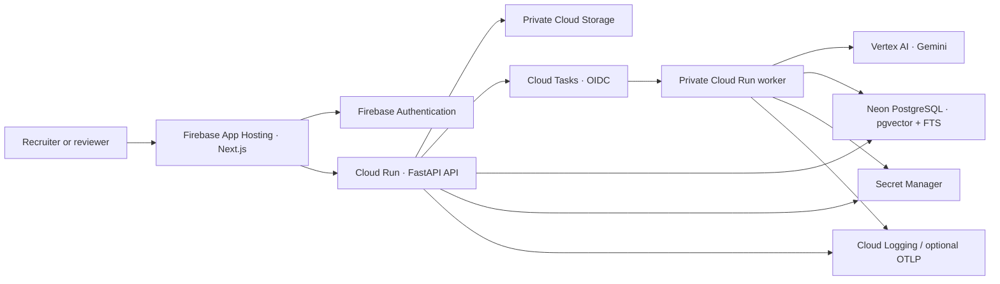

# Architecture

GulfDocs separates interactive requests from deterministic document processing. The browser never receives backend credentials and uploads directly to private Storage with a short-lived signed URL.

The public demo is a separate bounded path using fictional packaged data and precomputed answers. It permits no uploads and consumes no live model quota.

## Request path

1. The web app obtains a Firebase ID token and adds a caller-generated correlation ID.
2. FastAPI verifies identity, creates/loads the personal workspace, and scopes every query to it.
3. The API returns typed JSON and a safe error/request identifier. It never returns raw prompts or provider responses.

## Deployment boundaries

Firebase App Hosting owns frontend rollout. GitHub Actions is the quality gate and deploys only existing API/worker services using GitHub OIDC/WIF. Terraform owns cloud resources and IAM. Secret values and Neon provisioning remain out of Terraform state.

## Local parity

Development swaps Firebase for deterministic dev auth, GCS for a path-confined local adapter, Cloud Tasks for an inline adapter, and Gemini for a fake provider. PostgreSQL/pgvector and the domain workflow remain the same, so tests exercise production semantics without cloud spend.
