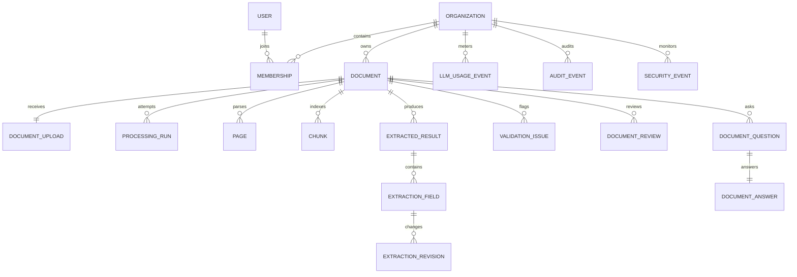

# Data model

The schema uses UUID keys, UTC timestamps, foreign keys, constraints, and workspace-scoped indexes. Flexible model output/citations use JSONB; retrieval embeddings use 768-dimensional pgvector values and generated `tsvector` columns.

`documents.status` is constrained to the legal lifecycle. Upload idempotency is unique within a workspace; processing attempts are unique per document; fields are unique within one extraction result. Row locks prevent concurrent finalization. Repository and API predicates repeat workspace authorization rather than trusting a route-level check alone.

Content-bearing records are purged by retention cleanup while the sanitized document shell, processing metadata, and privacy-safe audit event remain. Database portability is preserved behind repository/service boundaries even though the current target is Neon PostgreSQL.
