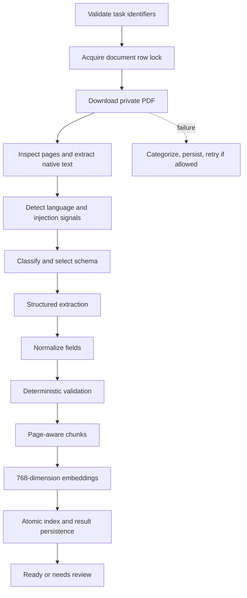

# Document pipeline

The worker runs a deterministic LangGraph state machine; the graph coordinates ordinary code and bounded provider calls rather than acting autonomously.

PyMuPDF preserves page boundaries and native Arabic text. The provider abstraction supplies classification, schema-constrained extraction, embeddings, and grounded answers. The fake implementation is deterministic; Gemini uses configured stable model names, bounded retries/timeouts, low temperature, schemas, and token ceilings.

Each field stores explicit availability, normalized value, confidence, and page citation. Validation covers required values, dates/order, currency, arithmetic, line-item totals, duplicate identifiers, cross-page consistency, and low-confidence critical values. Significant issues force `needs_review`; approval is impossible while blocking issues remain.

Cloud Tasks may deliver more than once. A unique run/attempt, row locking, terminal-state replay handling, atomic finalization, and temporary-file cleanup make processing idempotent. Task bodies contain only IDs, correlation ID, and attempt—not PDF bytes or secrets.

Limitations include handwriting, poor scans, rotation, passwords, damaged PDFs, complex multi-page tables, and unusual Arabic fonts. These are surfaced as failures or low confidence, not hidden as success.
